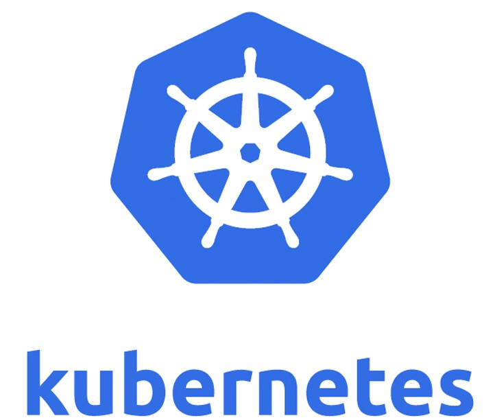

# Quick Reference Guides

<table>
  <tr>
    <td>
      
    </td>
    <td>
      
    </td>
    <td>
      
    </td>
  </tr>
</table>

A collection of quick reference guides on the following tools:
- [Docker](docker.md)
- [Kubernetes](kubernetes.md)
- [Google Cloud Platform](gcp.md)

I use these tools occasionally for work, and the guides here are a compilation of useful commands and lessons learnt from my experiences with them. I find these guides handy and refer to them quite frequently.

As such tools are frequently updated and certain commands may become obsolete over time, please use these guides at your own discretion. I welcome any feedback regarding incorrect or outdated information. Thank you, and I hope you find these useful.

~ Lee Ping