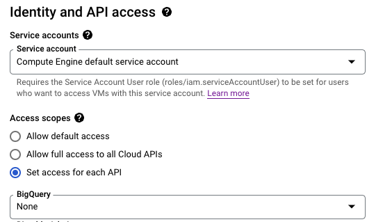
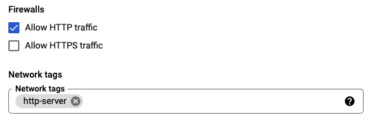
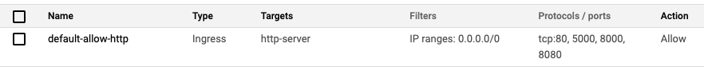
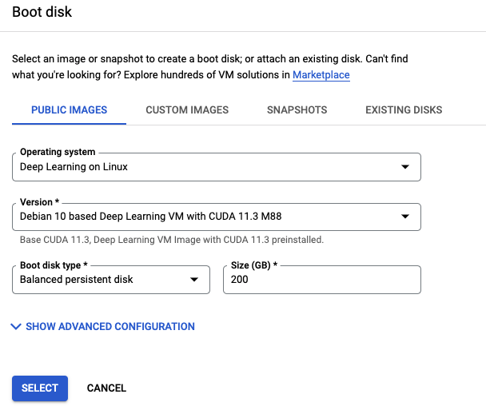

# Google Cloud Quick Reference

This Google Cloud quick reference guide is a compilation of useful commands and lessons learnt from my experiences with GCP at work.

## Table of Contents
- [Writing to Cloud Storage](#writing-to-cloud-storage)
- [Making HTTP Requests](#making-http-requests)
- [Pushing to Container Registry](#pushing-to-container-registry)
- [Using GPUs](#using-gpus)

## Writing to Cloud Storage

Your application may have to write to Google Cloud Storage (GCS) sometimes. If you’re getting the following error, you’re lacking the permission to write to GCS.
```
Caller does not have storage.objects.create access to the Google Cloud Storage bucket
```

- **From local machine**
    - Ensure that the [service account](https://cloud.google.com/iam/docs/creating-managing-service-accounts) you’re using has the correct permissions, e.g. `storage.objects.create`. Create a new one if necessary, but only give it the minimal permissions required.
    - Create and download the [service account key](https://cloud.google.com/iam/docs/creating-managing-service-account-keys), which is usually a JSON file.
    - Set the `GOOGLE_APPLICATION_CREDENTIALS` environment variable on your terminal and point it to the JSON key as [instructed here](https://cloud.google.com/docs/authentication/getting-started#auth-cloud-implicit-python).
- **From Google Compute Engine or Google Kubernetes Engine**
    - When creating the GCE/GKE Instance using Cloud CLI - `Set access for each API`:
        - By default, `Storage` has `Read Only` permissions - change it to `Read Write`.

            
            
    - Note: GCE/GKE uses the Compute Engine default service account, which by default has permissions to write to GCS, but it doesn’t work unless you do the above. I've even tried creating a new service account with `owner` permissions, with the same result.


## Making HTTP Requests

If you have a server (Flask, FastAPI, etc) running on a GCP instance and you are unable to make HTTP requests to it, there could be various reasons:

- **Request timed out error**
    1. **Is the VM/ cluster still running?**
        
        `ping <IP address>` of the GCE instance/ GKE load balancer. If you don’t get a response, check that the VM/ cluster is still up. 
        
    2. **Are you using the right IP address?**
        
        The external IP addresses of GCE instances are ephemeral by default - when you stop an instance, and then start it, it’s external IP address would have changed.  If you need this to be fixed for a customer, you can [reserve an external static IP address](https://cloud.google.com/compute/docs/ip-addresses/reserve-static-external-ip-address#reserve_new_static) at a cost.
        
    3. **Is GCP’s firewall blocking your HTTP requests?**
        
        If you were able to ping, next try: `telnet <IP address> <port number>`. If you’re unable to connect, it could be due to the following reasons:
        
        - In GCP, by default, all incoming traffic from outside a network is blocked. Network tags and firewall rules can be set to allow specific network traffic from the internet. You have to allow HTTP traffic when creating the VM, under the `Firewalls` section. Once this is checked, you’ll notice that a `http-server` network tag is added.
            
            
            
            If you check what is `http-server` using Cloud Console under `VPC Network` >> `Firewall`, you’ll see that it allows TCP ingress for port 80 (by default). However, you will need [root privileges to use TCP ports lower than 1024](https://stackoverflow.com/questions/53606351/gcp-compute-engine-cannot-listen-on-port-80). In the screenshot below, I added **ports 5000, 8000 and 8080**.
            
            
            
        - Also, ensure that your server is listening to `0.0.0.0`, e.g. `gunicorn --bind 0.0.0.0:5000`.
    4. **Has your server crashed due to bugs?**
        
        If the above approaches don’t solve the problem, test your server locally and see if requests are timing out because the server has crashed due to bugs. If the server is contained within a Docker container, and the container stops running after a while, most likely it has crashed.
        
- **Connection refused error**
    
    Generally, this could be because the port is not open on the destination machine, or a firewall between the client and server is blocking access.
    
    1. **Is your server app’s port whitelisted by VPC firewall?**
        
        See detailed explanation in the above “Request timed out error” section. Let’s assume that the firewall whitelists ports 5000, 8000 and 8080 for the scenarios below:
        
        - Server port = 5000, you make a request to port 5000 → Okay
        - Server port = 5000, you make a request to port 5555 by mistake → Request will time out
        - Server port = 5555, you make a request to port 5555 → Request will time out as 5555 is not whitelisted by firewall
        - Server port = 5000, you make a request to port 8000 → Connection refused

- **Docker related**

    See the [receiving traffic](docker.md#receiving-traffic) section of Docker guide.

- **Kubernetes related**

    In Kubernetes, a [service](https://kubernetes.io/docs/concepts/services-networking/service/) exposes a set of pods to outside the cluster, and allows the applications running within the pods to receive traffic. When describing the service in the [service.yaml](https://kubernetes.io/docs/concepts/services-networking/service/), a `port` and a `targetPort` have to be defined. 

    Example:

    - Your Flask app from within the container is listening on port 5000 → this is `<targetPort>`.
    - You want to make a request to the cluster on port 8000 (note that it can also be the same port number as `<targetPort>`) → This is `<port>`.

    There is also `nodePort`, which is also in *service.yaml*, as well as `containerPort`, which is in *deployment.yaml*, but I haven’t had a need to declare them.


## Pushing to Container Registry

This section shows how you can push your Docker images to Google Container Registry (GCR) to be used by compute instances.

- Firstly, configure authentication to GCR using [gcloud credential helper](https://cloud.google.com/container-registry/docs/advanced-authentication#gcloud-helper).
    - Ensure that the service account you’re using has the correct permissions to push to GCR: `storage.objects.create`.
    - Create and download the service account key, which is usually a JSON file.
    - Run this command to configure authentication with service account credentials:
        
        ```bash
        >> gcloud auth activate-service-account <USERNAME>@<PROJECT-ID>.iam.gserviceaccount.com --key-file=<path to service account key> 
        ```
        
    - Configure Docker with the following command:
        
        ```bash
        >> gcloud auth configure-docker
        ```
        
- Push to GCR (it will take a while).
    
    ```bash
    >> docker push <name:tag>
    ```
    
- Once the push is complete, you should be able to see your Docker image in GCR.


## Using GPUs

GPU instances on GCP are very expensive, and in many cases, if not set up properly, your GCP instances may not be using the GPUs even though you've paid for them.

- **GPU instance setup**
    - DO NOT create instances with a container (even if your app has been dockerised). When this option is chosen, the VM comes with a “Container Optimised OS” which doesn’t come with CUDA toolkit and drivers, and therefore you can’t access the GPU.
    - Change the boot disk settings. Note that the Version gets updated from time to time - in Jul 2021 the latest was `m75 CUDA 11.0`. 200 GB sounds generous but storage is cheaper than having to redo this all over again if you run out of space.

        

    - Click `CREATE` at the bottom. Return to the `VM Instances` page, and it should be created after a few moments

- **NVIDIA setup and checks**
    - Click on `SSH` to the right of the VM details, and a terminal will appear. If using a VM with GPU, it’ll first prompt you to install the Nvidia driver - select `y`
    - If installed successfully, the commands `nvidia-smi` and `nvcc --version` should show correct information. If it did not install successfully (which happens sometimes), scroll up to the top of the terminal, there should be an instruction to “reinstall Nvidia driver (if needed)”. You might need to wait a few minutes before attempting to reinstall.

- **TensorFlow/Pytorch checks**
    - Check that these frameworks are able to detect the GPU - else you'll be running on CPU and wondering why training/inference is so slow!
    - For TensorFlow: `import tensorflow` and use the `tf.config.list_physical_devices("GPU")` command
    - For Pytorch: `import torch` and use the `torch.cuda.is_available()` and `torch.cuda.get_device_name(0)` commands